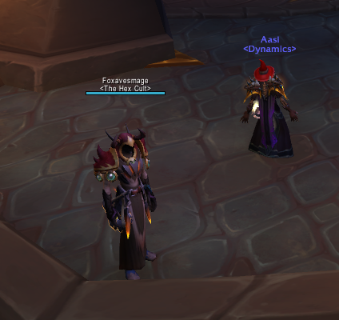

# feldewar

C++ code snippet:

```cpp
#include <iostream>

int main(int argc, char** argv)
{
    std::cout << "Hello, World!" << std::endl;
    return 1;
}
```

* list-item
* list-item2
* list-item3

## Heading1

Todo:

* [x] item1
* [ ] item2
* [ ] item3
*
*
[ ] 
    <figure><figcaption></figcaption></figure>
